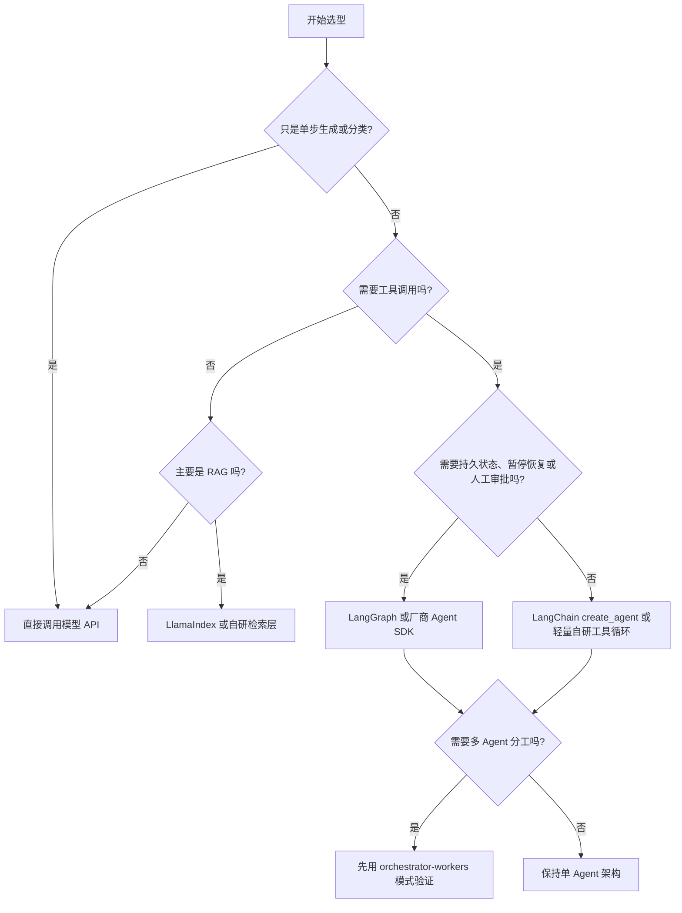

# AI Agent 最佳实践指南

## 第三章：技术选型 —— 为 Agent 选择可演进的技术栈

> 技术选型不是列出最热门的模型和框架，而是把任务、风险、成本和团队能力对齐。

---

## 3.1 技术选型的核心原则

在选择模型、框架和基础设施之前，先回答四个问题：

| 问题 | 需要明确的内容 |
|------|----------------|
| 任务类型 | 是问答、RAG、工具调用、工作流编排，还是长时间自主执行？ |
| 风险等级 | 是否会写数据、发消息、执行代码、访问隐私数据或影响生产系统？ |
| 质量目标 | 更看重准确率、延迟、成本、可解释性，还是稳定复现？ |
| 运行约束 | 是否有数据驻留、私有化部署、审计、合规或预算限制？ |

**核心原则**：

1. 从最小可行系统开始，不要一开始就堆多 Agent、多模型和复杂记忆。
2. 对高风险工具调用建立权限、审计和人工确认，而不是只依赖 Prompt。
3. 把模型、工具、记忆、评估和观测作为一个系统选型，避免只比较单点能力。
4. 对快速变化的产品名称、价格和上下文窗口标注核验日期。

> 本章事实核验基准日期：2026-05-09。模型名称、价格、上下文窗口和 API 能力在发布前必须重新核验。

---

## 3.2 LLM 选型：按任务选模型，而不是按排行榜选模型

### 3.2.1 主流模型类别

| 类别 | 代表方向 | 适合场景 | 注意事项 |
|------|----------|----------|----------|
| 闭源前沿模型 | OpenAI GPT-5.x、Claude 4.x、Gemini 2.5/3.x 等 | 复杂推理、工具调用、代码、长上下文、多模态 | 成本、限流、区域可用性和数据政策要核验 |
| 小型/快速模型 | 各厂商 mini、flash、haiku、instant 类模型 | 分类、摘要、路由、格式转换、低延迟交互 | 不适合承担高风险最终决策 |
| 开源/可私有化模型 | Llama、Qwen、DeepSeek、Mistral 等系列 | 数据敏感、成本可控、私有化部署 | 运维、推理优化、评测和安全加固成本更高 |
| 专用工具模型 | embedding、rerank、speech、vision、computer-use、code interpreter 等 | 检索、排序、语音、视觉、浏览器/桌面操作 | 不应和通用聊天模型混为一类比较 |

### 3.2.2 选型建议

```typescript
type Scenario = {
  risk: "low" | "medium" | "high";
  latencySensitive: boolean;
  costSensitive: boolean;
  needsLongContext: boolean;
  hasPrivateData: boolean;
  needsToolUse: boolean;
};

function selectModelLane(scenario: Scenario): string {
  if (scenario.risk === "high" || scenario.needsToolUse) {
    return "frontier-model-with-structured-tools-and-guardrails";
  }

  if (scenario.latencySensitive || scenario.costSensitive) {
    return "small-fast-model-with-escalation";
  }

  if (scenario.needsLongContext) {
    return "long-context-model-plus-retrieval";
  }

  if (scenario.hasPrivateData) {
    return "private-deployment-or-provider-with-required-data-controls";
  }

  return "default-general-purpose-model";
}
```

### 3.2.3 多模型路由

生产系统通常不是“一个模型打天下”，而是按任务路由：

```python
class ModelRouter:
    def route(self, task):
        if task.requires_tool_use or task.risk == "high":
            return "frontier"
        if task.kind in {"classification", "formatting", "summarization"}:
            return "fast"
        if task.context_tokens > 200_000:
            return "long_context"
        if task.contains_private_data:
            return "private_or_region_locked"
        return "default"
```

路由规则必须和评估数据绑定。不要只凭“感觉”把任务切给便宜模型；应该定期抽样比较成功率、误拒率、工具调用错误率和成本。

---

## 3.3 框架选型：先判断是否真的需要框架

### 3.3.1 常见技术路线

| 路线 | 适合场景 | 优点 | 风险 |
|------|----------|------|------|
| 直接调用模型 API | 单步任务、轻量工具调用、团队需要完全控制 | 简单、透明、依赖少 | 需要自己处理状态、重试、观测和工具协议 |
| LangChain `create_agent` | 快速构建工具型 Agent | 上手快，生态丰富，底层基于 LangGraph | 抽象层较多，版本迁移要跟进 |
| LangGraph | 有状态工作流、人类审批、可恢复执行、多步骤任务 | 持久化、分支、恢复和人机协作能力强 | 学习成本高于普通链式调用 |
| LlamaIndex | RAG、知识库、文档处理 | 检索和索引能力成熟 | 不应承担所有工作流编排职责 |
| OpenAI Agents SDK / Claude Agent SDK 等厂商 SDK | 深度使用某厂商模型、内置工具、handoff、guardrails、tracing | 和模型能力结合紧密，生产功能完整 | 厂商绑定更强，跨模型迁移成本要评估 |
| AutoGen / CrewAI 等多 Agent 框架 | 研究、多角色原型、协作流程探索 | 多 Agent 概念清晰 | 生产落地前要验证可观测性、成本和失败恢复 |

### 3.3.2 决策树



### 3.3.3 什么时候不使用复杂框架？

考虑不使用复杂 Agent 框架的情况：

1. 任务可以被一个结构化模型调用解决。
2. 业务流程固定，普通工作流引擎更可控。
3. 团队还没有评估、追踪、权限和回滚基础设施。
4. 框架抽象让 Prompt、工具参数和失败原因变得不可见。

Anthropic 的 Agent 工程建议也强调：先选择最简单可行方案，只有当复杂度确实换来任务表现提升时再升级为工作流或 Agent。

---

## 3.4 工具与基础设施选型

### 3.4.1 记忆系统

| 类型 | 适合保存 | 常见实现 |
|------|----------|----------|
| 会话状态 | 当前对话、当前任务步骤、中间结果 | LangGraph checkpointer、Redis、数据库 |
| 用户画像 | 偏好、权限、长期设置 | PostgreSQL、profile store、KV store |
| 语义记忆 | 文档片段、历史经验、可模糊检索文本 | Chroma、Pinecone、Weaviate、Milvus、PGVector |
| 关系记忆 | 实体、关系、依赖图 | Neo4j、ArangoDB、知识图谱 |
| 审计日志 | 输入、工具参数、工具结果、审批记录 | append-only log、对象存储、SIEM |

不要把所有记忆都塞进向量数据库。用户权限、审计记录、订单状态这类结构化数据应该进入事务型数据库；向量库主要负责语义召回。

### 3.4.2 观测与评估

```python
observability_stack = {
    "logs": ["structured logging", "PII redaction"],
    "traces": ["OpenTelemetry", "LangSmith", "provider tracing"],
    "metrics": ["Prometheus", "Grafana"],
    "evals": ["golden tasks", "LLM-as-judge with calibration", "human review"],
    "cost": ["token usage", "tool calls", "retry count", "cache hit rate"],
}
```

Agent 系统至少要记录：

- 用户请求、模型选择、工具选择和最终输出。
- 每次工具调用的输入、输出、耗时、错误和权限决策。
- 任务是否成功、失败原因、是否人工介入。
- token 成本、外部 API 成本、重试次数和超时次数。

### 3.4.3 部署基础设施

| 平台 | 适合场景 | 注意事项 |
|------|----------|----------|
| Docker Compose | 原型、小团队、内部工具 | 不要直接承载高可用生产流量 |
| Serverless / PaaS | 轻量 Web API、事件触发任务 | 注意长任务超时、冷启动、后台任务恢复 |
| Kubernetes / ECS | 长任务、多服务、高可用 | 需要团队有运维能力 |
| 托管 Agent 平台 | 快速集成厂商工具和追踪 | 评估数据政策、迁移成本和可观测性出口 |
| 私有化部署 | 数据敏感、合规要求高 | 推理、监控、补丁、安全运营成本更高 |

---

## 3.5 推荐技术栈

### 3.5.1 最小可行栈

```text
模型: 一个通用前沿模型 + 一个便宜快速模型
框架: LangChain create_agent 或直接调用模型 API
记忆: SQLite/PostgreSQL 存结构化数据，Chroma 或 InMemoryVectorStore 做本地语义检索
工具: 2-3 个只读工具起步
观测: 结构化日志 + trace id + 基础成本统计
部署: Docker Compose 或 PaaS
```

适合原型验证、内部工具和小型团队。

### 3.5.2 生产就绪栈

```text
模型: 多模型路由，关键路径使用前沿模型，低风险任务使用快速模型
编排: LangGraph、厂商 Agents SDK 或明确的自研状态机
记忆: PostgreSQL + Redis + 向量库，审计日志单独保存
安全: 工具权限矩阵、人工审批、速率限制、输入/输出 guardrails
观测: OpenTelemetry + Prometheus/Grafana + Agent trace + 离线 eval
部署: Kubernetes/ECS/托管平台，支持灰度、回滚和队列化长任务
```

适合企业应用、高可用服务和会写入业务系统的 Agent。

### 3.5.3 成本优化栈

```text
模型: 快速模型承担路由/摘要/分类，前沿模型只处理复杂或高风险任务
检索: 优先缓存、去重、rerank，避免重复 embedding
部署: 批处理、队列、限流、结果缓存
评估: 用任务成功率和人工抽检决定哪些任务可以降级
```

成本优化不能只换便宜模型。更有效的杠杆通常是：减少无效步骤、缓存检索结果、限制工具数量、避免反复重试。

---

## 3.6 技术选型检查清单

- [ ] 明确了核心任务和不能失败的场景。
- [ ] 为不同风险等级定义了模型、工具和人工审批策略。
- [ ] 所有模型和框架名称都标注了核验日期。
- [ ] 关键代码示例已在干净环境中跑通。
- [ ] 有离线评估集和上线后的监控指标。
- [ ] 有成本预算、限流策略和异常熔断策略。
- [ ] 明确了数据保存位置、保留期限和删除机制。
- [ ] 评估了 vendor lock-in 风险和迁移路径。
- [ ] 有回滚方案和人工接管流程。

---

## 3.7 本章小结

学习要点：

1. 技术选型要从任务、风险、质量目标和运行约束出发。
2. 模型表必须带核验日期，不能把架构绑定到某个短期热门版本。
3. 框架不是越复杂越好；直接 API、LangChain、LangGraph、RAG 框架和厂商 SDK 各有边界。
4. 记忆、工具、观测、评估和部署要一起设计。
5. 生产 Agent 的核心不是“会调用工具”，而是“可控、可测、可恢复、可审计”。

下一章我们将深入单 Agent 架构模式，从 ReAct 到更复杂的状态化架构。

---

**思考问题**：

1. 你的场景中，失败成本最高的工具调用是什么？
2. 哪些任务可以交给便宜快速模型，哪些必须使用强模型？
3. 如果明天要替换模型供应商，你的系统需要改多少代码？

---

*本章结束*
