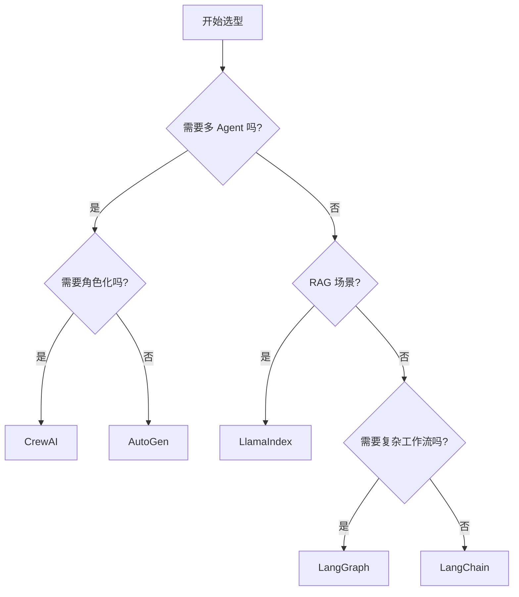

# AI Agent 最佳实践指南

## 第三章：技术选型 —— 为你的 Agent 选择合适的武器

> "选择合适的工具，任务就完成了一半。"

---

## 3.1 技术选型的核心原则

在开始选择技术栈之前，先明确这几个核心原则：

| 原则 | 说明 |
|------|------|
| **问题驱动** | 先明确要解决什么问题，再选工具 |
| **够用就好** | 不要为了炫技而使用复杂的技术 |
| **团队能力** | 考虑团队对技术的熟悉程度 |
| **生态成熟度** | 选择有活跃社区和丰富文档的技术 |
| **可演进性** | 技术栈要能随着项目成长 |

---

## 3.2 LLM 选型：Agent 的大脑

### 3.2.1 主流 LLM 对比

| 模型 | 能力 | 速度 | 成本 | 上下文 | 最佳场景 |
|------|------|------|------|--------|----------|
| **GPT-4** | ⭐⭐⭐⭐⭐ | ⭐⭐⭐ | ⭐ | 8K/32K/128K | 复杂推理、工具使用 |
| **Claude 3** | ⭐⭐⭐⭐⭐ | ⭐⭐⭐⭐ | ⭐⭐ | 200K | 长文档、安全敏感场景 |
| **Gemini Pro** | ⭐⭐⭐⭐ | ⭐⭐⭐⭐ | ⭐⭐ | 32K | 多模态、快速迭代 |
| **Llama 3** | ⭐⭐⭐ | ⭐⭐⭐⭐⭐ | ⭐⭐⭐⭐ | 8K/70K | 私有化部署、成本敏感 |
| **Qwen** | ⭐⭐⭐⭐ | ⭐⭐⭐⭐ | ⭐⭐⭐⭐ | 32K | 中文场景、本地化 |

### 3.2.2 选型建议

```typescript
// 决策树
function selectLLM(scenario: Scenario): LLM {
  if (scenario.hasSensitiveData) {
    return scenario.hasResources ? "Llama 3 (self-hosted)" : "Claude 3";
  }
  
  if (scenario.needsComplexReasoning) {
    return "GPT-4";
  }
  
  if (scenario.hasLongDocuments) {
    return "Claude 3";
  }
  
  if (scenario.isCostSensitive) {
    return "Llama 3 (self-hosted) or Qwen";
  }
  
  // 默认
  return "GPT-4";
}
```

### 3.2.3 多模型策略

**不要把鸡蛋放在一个篮子里！**

```python
# 多模型路由示例
class MultiLLMRouter:
    def __init__(self):
        self.models = {
            "complex": GPT4(),
            "fast": Claude3Haiku(),
            "long": Claude3Opus(),
            "cheap": Llama3()
        }
    
    def route(self, task):
        if task.complexity > 0.8:
            return self.models["complex"]
        elif task.context_length > 50000:
            return self.models["long"]
        elif task.cost_sensitive:
            return self.models["cheap"]
        else:
            return self.models["fast"]
```

---

## 3.3 框架选型：Agent 的骨架

### 3.3.1 主流框架对比

| 框架 | 灵活性 | 易用性 | 生态 | 生产就绪 | 最佳场景 |
|------|--------|--------|------|----------|----------|
| **LangChain** | ⭐⭐⭐⭐ | ⭐⭐⭐ | ⭐⭐⭐⭐⭐ | ⭐⭐⭐ | 快速原型、通用场景 |
| **AutoGen** | ⭐⭐⭐⭐⭐ | ⭐⭐ | ⭐⭐⭐ | ⭐⭐⭐⭐ | 多 Agent 协作 |
| **CrewAI** | ⭐⭐⭐⭐ | ⭐⭐⭐⭐ | ⭐⭐⭐ | ⭐⭐⭐ | 角色化多 Agent |
| **LlamaIndex** | ⭐⭐⭐ | ⭐⭐⭐⭐ | ⭐⭐⭐⭐ | ⭐⭐⭐⭐ | RAG 场景、知识库 |
| **LangGraph** | ⭐⭐⭐⭐⭐ | ⭐⭐ | ⭐⭐ | ⭐⭐⭐⭐ | 复杂工作流、状态管理 |

### 3.3.2 框架选择决策树



### 3.3.3 什么时候不使用框架？

**考虑不使用框架的情况**：

1. **超简单的场景**：单 LLM 调用，无需工具
2. **极致性能需求**：需要完全控制每一层
3. **特殊定制需求**：框架无法满足的特殊逻辑
4. **学习目的**：想深入理解 Agent 原理

**自己实现的最小 Agent**：

```python
class MinimalAgent:
    def __init__(self, llm, tools):
        self.llm = llm
        self.tools = tools
        self.memory = []
    
    def run(self, task):
        while not self.is_complete(task):
            # 思考
            thought = self.llm(self.format_prompt(task))
            
            # 决策
            action = self.parse_action(thought)
            
            # 执行
            if action.type == "tool":
                result = self.tools[action.name](action.input)
                self.memory.append(("tool_result", result))
            elif action.type == "finish":
                return action.output
            
            self.memory.append(("thought", thought))
    
    # ... 辅助方法
```

---

## 3.4 工具与基础设施选型

### 3.4.1 记忆系统（向量数据库）

| 数据库 | 部署方式 | 性能 | 生态 | 最佳场景 |
|--------|----------|------|------|----------|
| **Pinecone** | 托管 | ⭐⭐⭐⭐⭐ | ⭐⭐⭐⭐⭐ | 生产环境、大规模 |
| **Weaviate** | 自托管/托管 | ⭐⭐⭐⭐ | ⭐⭐⭐⭐ | 自托管、丰富功能 |
| **Milvus** | 自托管/托管 | ⭐⭐⭐⭐⭐ | ⭐⭐⭐ | 高性能、企业级 |
| **Chroma** | 本地/自托管 | ⭐⭐⭐ | ⭐⭐⭐⭐ | 开发、原型 |
| **PGVector** | PostgreSQL 扩展 | ⭐⭐⭐ | ⭐⭐⭐ | 已用 PostgreSQL |

### 3.4.2 观测与监控

```python
# 推荐的观测栈
observability_stack = {
    "logging": ["Python logging", "structlog"],
    "tracing": ["OpenTelemetry", "LangSmith"],
    "metrics": ["Prometheus", "Grafana"],
    "debugging": ["LangSmith", "Weave"],
    "evaluation": ["LangChain Evaluators", "HumanEval"]
}
```

### 3.4.3 部署基础设施

| 平台 | 易用性 | 可扩展性 | 成本 | 最佳场景 |
|------|--------|----------|------|----------|
| **Docker + Docker Compose** | ⭐⭐⭐⭐⭐ | ⭐⭐ | ⭐⭐⭐⭐⭐ | 小型部署、开发 |
| **Kubernetes** | ⭐⭐ | ⭐⭐⭐⭐⭐ | ⭐⭐ | 大规模、生产 |
| **AWS ECS / Fargate** | ⭐⭐⭐ | ⭐⭐⭐⭐ | ⭐⭐⭐ | AWS 生态 |
| **Vercel / Render** | ⭐⭐⭐⭐⭐ | ⭐⭐⭐ | ⭐⭐⭐ | Web 服务、快速部署 |

---

## 3.5 完整技术栈推荐

### 3.5.1 最小可行栈（MVP）

```
LLM: GPT-4 / Claude 3
框架: LangChain
记忆: Chroma (本地)
部署: Docker Compose
观测: 日志文件 + LangSmith (试用)
```

**适用场景**：
- 原型验证
- 个人项目
- 小型团队

### 3.5.2 生产就绪栈

```
LLM: 多模型策略 (GPT-4 + Claude 3 + 备用)
框架: LangChain / LangGraph
记忆: Pinecone / Weaviate
数据库: PostgreSQL (用户数据) + Redis (缓存)
部署: Kubernetes / AWS ECS
观测: OpenTelemetry + Prometheus + Grafana + LangSmith
CI/CD: GitHub Actions / GitLab CI
```

**适用场景**：
- 企业级应用
- 高可用要求
- 大规模用户

### 3.5.3 成本优化栈

```
LLM: Llama 3 (自托管) / Qwen
框架: LangChain / 自研
记忆: Milvus (自托管) / PGVector
部署: 便宜的云主机 + Docker
观测: 开源工具 (ELK Stack)
```

**适用场景**：
- 预算有限
- 数据敏感
- 技术能力强

---

## 3.6 技术选型检查清单

在做最终决定前，检查这些项目：

- [ ] 明确了要解决的核心问题
- [ ] 评估了团队的技术能力
- [ ] 做了小范围的技术验证（POC）
- [ ] 考虑了未来 6-12 个月的演进
- [ ] 评估了 vendor lock-in 风险
- [ ] 有回滚和迁移计划
- [ ] 成本在预算范围内
- [ ] 有足够的文档和社区支持
- [ ] 团队对选择有信心

---

## 3.7 本章小结

✅ **学习要点**：
1. 技术选型要问题驱动，不要炫技
2. LLM 选择考虑能力、成本、上下文、数据安全
3. 框架选择看场景：多 Agent、RAG、复杂工作流
4. 记忆系统、观测、部署同样重要
5. 从 MVP 开始，逐步演进到生产栈

🚀 **下一步**：
下一章我们将深入单 Agent 架构模式 —— 从简单的 ReAct 到更复杂的架构。

---

**思考问题**：
1. 你的场景中，LLM 的哪个特性最重要？
2. 你愿意为框架的易用性放弃多少灵活性？
3. 你的预算和数据安全要求如何影响选型？

---

*本章结束* 📖
